# Capstone: Autonomous Humanoid

## Overview

The **Capstone project** integrates all four modules into a complete autonomous humanoid system that can:
1. **Listen** to voice commands (Module 4: Whisper)
2. **Plan** action sequences (Module 4: LLM)
3. **Navigate** to targets (Module 3: Isaac ROS Nav2)
4. **Perceive** objects (Module 3: Isaac ROS object detection)
5. **Execute** actions (Module 1: ROS 2 controllers)
6. **Validate** in simulation (Module 2: Gazebo/Unity OR Module 3: Isaac Sim)

**Goal**: Demonstrate that you can design, simulate, and deploy a humanoid robot that performs useful tasks in human environments.

## System Architecture

```mermaid
graph TD
    A[🎤 Voice Input] -->|Whisper| B[📝 Text Command]
    B -->|LLM Planner| C[🧠 Skill Sequence]
    C -->|ROS 2 Actions| D{Skill Router}
    D -->|navigate_to| E[Nav2 Path Planner]
    D -->|pick_object| F[Manipulation Controller]
    D -->|scan_env| G[Isaac ROS Perception]
    E -->|/cmd_vel| H[🤖 Simulated/Real Robot]
    F -->|/gripper_cmd| H
    G -->|Object poses| C
    H -->|Sensor feedback| G
    H -->|Status| C
```



## Example: "Bring Me the Red Cup"

**User Command (Voice)**: "Bring me the red cup from the table"

**Pipeline Execution**:

1. **Whisper Transcription**:
   - Input: Audio waveform
   - Output: Text = "Bring me the red cup from the table"

2. **LLM Planning** (GPT-4 / Claude):
   ```
   Prompt: "You are a humanoid robot. User said: 'Bring me the red cup from the table'.
            Available skills: navigate_to, scan_environment, detect_object, pick_object, release_object.
            Plan step-by-step."

   LLM Output:
   [
     {"skill": "navigate_to", "args": {"location": "table"}},
     {"skill": "scan_environment", "args": {}},
     {"skill": "detect_object", "args": {"query": "red cup"}},
     {"skill": "pick_object", "args": {"target": "red_cup_pose"}},
     {"skill": "navigate_to", "args": {"location": "user"}},
     {"skill": "release_object", "args": {}}
   ]
   ```

3. **Skill Execution** (ROS 2 Actions):
   - `navigate_to("table")` → Calls Nav2 action server `/navigate_to_pose`
   - `scan_environment()` → Rotates camera, builds object map
   - `detect_object("red cup")` → Runs YOLO/OWL-ViT on Isaac ROS
   - `pick_object(pose)` → Executes grasp trajectory with arm controller
   - `navigate_to("user")` → Returns to user location
   - `release_object()` → Opens gripper

4. **Simulation Validation** (Isaac Sim):
   - Test entire pipeline in virtual kitchen
   - Verify: Navigation avoids obstacles, object detection works in varied lighting, grasp succeeds

5. **Hardware Deployment** (Unitree G1 / OP3):
   - Deploy tested pipeline on physical robot
   - Monitor: Sensor noise handling, contact forces, battery life

## Learning Outcomes

After completing the Capstone, you will be able to:
1. ✅ Integrate ROS 2, simulation, perception, and VLA into one system
2. ✅ Debug multi-module failures (e.g., "Why did object detection fail?")
3. ✅ Adapt LLM prompts for robot task planning
4. ✅ Transfer behaviors from simulation to real hardware
5. ✅ Design skill libraries for new robot capabilities

## Capstone Variants

### Variant 1: Sim-to-Sim (No Physical Hardware)
- **Platform**: Isaac Sim
- **Scope**: Full pipeline in simulation only
- **Deliverable**: Screen recording of robot executing "Bring me X" tasks

### Variant 2: Sim-to-Real (With Jetson + Sensors)
- **Platform**: Isaac Sim (training) → Jetson Orin (deployment)
- **Scope**: Deploy perception on real cameras, navigation on real wheels/legs
- **Deliverable**: Video of physical robot responding to voice commands

### Variant 3: Advanced (Full Humanoid)
- **Platform**: Isaac Sim → Unitree G1 / OP3
- **Scope**: Bipedal walking, dexterous manipulation, multimodal interaction
- **Deliverable**: Demonstration at robotics conference or competition

## Evaluation Criteria

Your Capstone will be assessed on:

1. **Functionality** (40%):
   - Does the robot complete the commanded task?
   - How robust is it to variations (different lighting, object positions)?

2. **Integration** (30%):
   - Are all four modules properly integrated?
   - Clear separation of concerns (perception, planning, control)?

3. **Sim-to-Real Transfer** (20%):
   - If using physical hardware, does simulation predict real-world behavior?
   - How much tuning was needed after transfer?

4. **Documentation** (10%):
   - Clear README explaining system architecture
   - Video demonstration with narration
   - APA-cited references for algorithms used

## Next Steps

**In Iteration 2**, you will learn:
- How to implement the complete VLA pipeline in ROS 2 Python
- How to prompt LLMs for robust task planning
- How to tune Isaac Sim parameters for sim-to-real transfer
- How to debug multi-module failures using ROS 2 tools (rqt, rviz, rosbag)

## References

Ahn, M., Brohan, A., Brown, N., et al. (2022). *Do As I Can, Not As I Say: Grounding Language in Robotic Affordances*. Conference on Robot Learning (CoRL).

Driess, D., Xia, F., Sajjadi, M. S., et al. (2023). *PaLM-E: An Embodied Multimodal Language Model*. arXiv preprint arXiv:2303.03378.

Macenski, S., Martín, F., White, R., & Ginés Clavero, J. (2020). *The Marathon 2: A Navigation System*. IEEE/RSJ International Conference on Intelligent Robots and Systems (IROS).
