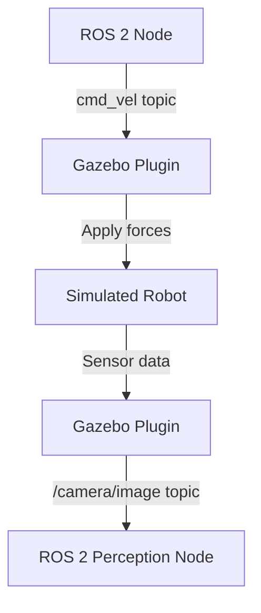

# Module 2: Digital Twin (Gazebo & Unity)

## Overview

A **Digital Twin** is a virtual replica of a physical robot that simulates physics, sensors, and environments. Before deploying code to expensive hardware, you test behaviors in simulation where failures are safe and iteration is fast.

**Why Simulation for Humanoid Robots?**
- **Safety**: Test dangerous maneuvers (falling, collisions) without risking hardware
- **Speed**: Iterate 10x faster than real-world experiments
- **Scalability**: Train in diverse environments (stairs, obstacles, weather) without physical setup
- **Cost**: Avoid hardware wear and tear during development

## Learning Outcomes

After completing this module, you will understand:
1. ✅ How Gazebo simulates rigid body physics (gravity, friction, collisions)
2. ✅ How virtual sensors (cameras, LiDAR, IMU) mimic real hardware
3. ✅ The role of Unity for photorealistic visualization
4. ✅ When to use Gazebo vs. Unity for humanoid robotics

## Gazebo vs. Unity

| Feature | Gazebo | Unity |
|---------|--------|-------|
| **Physics Engine** | ODE, Bullet, DART | PhysX, custom |
| **ROS 2 Integration** | Native (gazebo_ros) | Unity Robotics Hub |
| **Use Case** | Functional testing, sensor validation | Photorealistic rendering, VR/AR |
| **Performance** | Moderate (CPU-based physics) | High (GPU-accelerated) |
| **Learning Curve** | Steeper (XML config) | Gentler (visual editor) |

**Recommended Strategy**: Use **Gazebo** for rapid ROS 2 prototyping, **Unity** for visualization and human-robot interaction demos.

## Key Concepts

### 1. Physics Simulation
**Rigid Body Dynamics**: Simulates how forces (gravity, contact, motors) affect robot motion

**Humanoid Challenges**:
- **Balance**: Maintaining center of mass over support polygon
- **Contact Forces**: Foot-ground interaction, friction coefficients
- **Collisions**: Self-collision (arm hits torso), environment collisions (wall, stairs)

### 2. Sensor Simulation

#### Virtual Camera
Simulates RGB images with lens distortion, noise, motion blur

#### Virtual LiDAR
Simulates laser range finders (2D or 3D point clouds) with ray-casting

#### Virtual IMU (Inertial Measurement Unit)
Simulates accelerometer and gyroscope (with realistic noise models)

**Sim-to-Real Gap**: Virtual sensors are "perfect" by default. Add noise models to match real hardware.

### 3. World Files (Environment Definitions)
**Gazebo**: SDF (Simulation Description Format) XML files define:
- Terrain (flat ground, stairs, ramps)
- Objects (boxes, doors, furniture)
- Lighting (sun, point lights, shadows)

**Unity**: Scene files with GameObjects, Colliders, and ROS 2 publishers/subscribers

### 4. Gazebo-ROS Integration

**Plugins**: Gazebo plugins bridge simulated sensors/actuators with ROS 2 topics

## Prerequisites

- **Software**: ROS 2 (Module 1), basic 3D graphics concepts
- **Hardware**: GPU recommended (integrated graphics OK for simple scenes)
- **Experience**: Intermediate (requires ROS 2 knowledge)

## Connection to Other Modules

**← Module 1 (ROS 2)**: Simulation environments are controlled via ROS 2 topics/services
**→ Module 3 (Isaac)**: Isaac Sim provides GPU-accelerated, photorealistic simulation
**→ Module 4 (VLA)**: Simulated robots test VLA pipelines before hardware deployment

## Next Steps

**In Iteration 2**, you will learn:
- How to spawn a humanoid robot in Gazebo
- How to configure virtual sensors (cameras, LiDAR, IMU)
- How to create custom worlds with obstacles and terrain
- How to tune physics parameters (friction, damping, contact stiffness)

## References

Koenig, N., & Howard, A. (2004). *Design and use paradigms for Gazebo, an open-source multi-robot simulator*. IEEE/RSJ International Conference on Intelligent Robots and Systems (IROS).

Unity Technologies. (2024). *Unity Robotics Hub Documentation*. Retrieved from https://github.com/Unity-Technologies/Unity-Robotics-Hub
