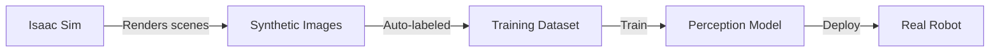

# Module 3: NVIDIA Isaac (AI-Robot Brain)

## Overview

**NVIDIA Isaac** is a platform for accelerating robot perception and simulation using GPU compute. It consists of:
- **Isaac Sim**: Photorealistic simulation with ray-traced rendering
- **Isaac ROS**: GPU-accelerated ROS 2 packages for VSLAM, object detection, and path planning

**Why Isaac for Humanoid Robotics?**
- **Real-Time Perception**: Process 30 FPS camera streams with deep learning models
- **Synthetic Data Generation**: Train vision models on simulated data
- **Sim-to-Real Transfer**: Close the reality gap with physics-accurate simulation
- **Jetson Integration**: Deploy the same pipelines on NVIDIA Jetson edge AI kits

## Learning Outcomes

After completing this module, you will understand:
1. ✅ How Isaac Sim generates synthetic training data for perception models
2. ✅ How Isaac ROS packages (VSLAM, Nav2, object detection) work
3. ✅ The difference between CPU-based (Gazebo) and GPU-based (Isaac Sim) simulation
4. ✅ How to deploy Isaac ROS perception pipelines on Jetson Orin

## Key Concepts

### 1. Isaac Sim (Photorealistic Simulation)

**Ray-Traced Rendering**: Simulates realistic lighting, shadows, reflections for training vision models

**Use Cases**:
- Generate millions of labeled images for object detection
- Test perception in varied lighting (sunrise, sunset, indoor, outdoor)
- Simulate sensor failures (occlusions, glare, motion blur)

**Physics Engine**: NVIDIA PhysX with GPU acceleration for parallel collision detection

### 2. Isaac ROS (GPU-Accelerated Perception)

**Packages**:
- **Visual SLAM (VSLAM)**: Simultaneous Localization and Mapping using stereo cameras
- **Nav2**: Navigation stack with costmap generation, path planning, obstacle avoidance
- **DNN Inference**: Run deep learning models (YOLO, Mask R-CNN) on GPU
- **Image Processing**: GPU-accelerated image filters, rectification, stereo matching

**Performance**: 10-100x faster than CPU-based equivalents

### 3. Synthetic Data Pipeline



**Domain Randomization**: Vary textures, lighting, camera angles to improve generalization

### 4. Sim-to-Real Transfer

**Challenge**: Models trained in simulation often fail on real hardware due to:
- Different lighting conditions
- Sensor noise (cameras, IMU, depth sensors)
- Physics discrepancies (friction, contact dynamics)

**Solutions**:
- **Realistic Rendering**: Isaac Sim's ray tracing reduces visual domain gap
- **Sensor Noise Models**: Add realistic noise to simulated sensors
- **Physics Tuning**: Match simulation parameters to real hardware measurements

## Prerequisites

- **Software**: ROS 2 (Module 1), Gazebo/Unity (Module 2), CUDA toolkit
- **Hardware**: RTX GPU (min RTX 3070, recommended RTX 4090) OR cloud GPU (AWS g5/g6e)
- **Experience**: Intermediate-to-Advanced (requires ROS 2, simulation, and GPU programming concepts)

### Hardware Decision Tree

```
Do you have RTX GPU (≥ RTX 3070)?
├─ YES → Install Isaac Sim locally (best performance)
└─ NO
   ├─ Can afford cloud GPU? → Use AWS g5.xlarge ($1-2/hour)
   └─ Budget constrained? → Use Gazebo for Module 2, Isaac concepts only
```

## Connection to Other Modules

**← Module 1 (ROS 2)**: Isaac ROS extends ROS 2 with GPU-accelerated nodes
**← Module 2 (Simulation)**: Isaac Sim replaces Gazebo for photorealistic simulation
**→ Module 4 (VLA)**: VLA systems use Isaac ROS perception for object detection and navigation

## Next Steps

**In Iteration 2**, you will learn:
- How to install Isaac Sim on RTX workstation or cloud instance
- How to generate synthetic datasets for humanoid perception
- How to run Isaac ROS VSLAM and Nav2 on Jetson Orin
- How to tune sim-to-real transfer for physical robots

## References

NVIDIA. (2024). *Isaac Sim Documentation*. Retrieved from https://docs.omniverse.nvidia.com/isaacsim/

NVIDIA. (2024). *Isaac ROS Documentation*. Retrieved from https://nvidia-isaac-ros.github.io/

Macenski, S., Martín, F., White, R., & Ginés Clavero, J. (2020). *The Marathon 2: A Navigation System*. IEEE/RSJ International Conference on Intelligent Robots and Systems (IROS).
