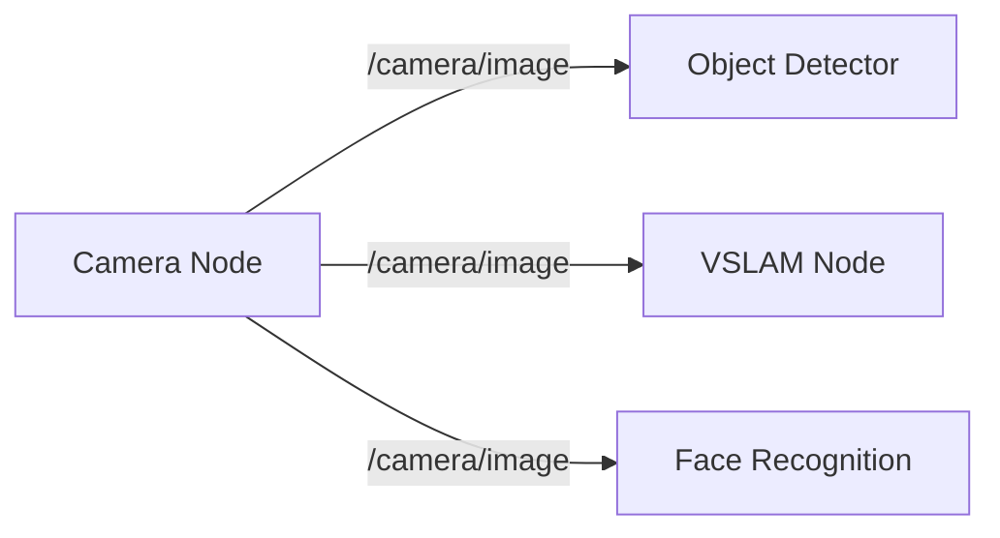

# Module 1: ROS 2 (Robotic Nervous System)

## Overview

**ROS 2 (Robot Operating System 2)** is the communication framework that serves as the "nervous system" for humanoid robots. It enables independent software components (nodes) to exchange messages, coordinate actions, and share sensor data in real-time.

**Why ROS 2 for Physical AI?**
- **Distributed Architecture**: Sensors, planners, controllers, and actuators run as separate processes
- **Middleware Flexibility**: DDS (Data Distribution Service) provides reliable, low-latency communication
- **Ecosystem**: Thousands of packages for perception, navigation, manipulation, and control
- **Industry Standard**: Used by Boston Dynamics, Agility Robotics, NVIDIA Isaac

## Learning Outcomes

After completing this module, you will understand:
1. ✅ How ROS 2 nodes communicate via Topics (pub/sub), Services (request/response), and Actions (goal-based)
2. ✅ The role of URDF (Unified Robot Description Format) in defining humanoid robot structure
3. ✅ How AI agents (LLMs, perception models) integrate with ROS 2 controllers
4. ✅ The difference between ROS 1 and ROS 2 (and why ROS 2 matters)

## Key Concepts

### 1. Nodes
**Definition**: Independent processes that perform specific tasks (e.g., camera driver, path planner, motor controller)

**Example**: A humanoid robot might have:
- `camera_node` → Publishes images from head-mounted camera
- `perception_node` → Detects objects in images
- `planner_node` → Plans walking trajectory
- `controller_node` → Sends motor commands to legs

### 2. Topics (Pub/Sub Messaging)
**Definition**: One-to-many asynchronous communication where nodes publish messages and others subscribe

**Use Case**: Broadcasting sensor data to multiple consumers



### 3. Services (Request/Response)
**Definition**: One-to-one synchronous communication for direct queries

**Use Case**: Asking a planner to compute a path

```
Client: "Plan path from A to B"
Server: "Here's the waypoint list: [x1,y1], [x2,y2], ..."
```

### 4. Actions (Goal-Based with Feedback)
**Definition**: Asynchronous goal-oriented tasks with progress feedback and cancellation

**Use Case**: Walking to a target location

```
Goal: "Navigate to kitchen"
Feedback: "50% complete, current position: (2.5, 1.3)"
Result: "Goal reached" or "Goal failed: obstacle detected"
```

### 5. URDF (Robot Description)
**Definition**: XML format describing robot structure (links, joints, sensors, actuators)

**Humanoid Example**:
- **Links**: Head, torso, left_arm, right_arm, left_leg, right_leg
- **Joints**: Shoulder (revolute), elbow (revolute), hip (spherical), knee (revolute)
- **Sensors**: Cameras in head, IMU in torso, force sensors in feet

## Prerequisites

- **Software**: Basic Python programming, Linux command line
- **Hardware**: None (this module uses simulation only)
- **Experience**: Beginner-friendly (no prior robotics required)

## Connection to Other Modules

**→ Module 2 (Digital Twin)**: ROS 2 nodes control simulated robots in Gazebo
**→ Module 3 (Isaac)**: Isaac ROS packages extend ROS 2 with GPU-accelerated perception
**→ Module 4 (VLA)**: LLMs send goals to ROS 2 Action servers

## Next Steps

**In Iteration 2**, you will learn:
- How to write ROS 2 nodes in Python (`rclpy`)
- How to define custom message types
- How to visualize topics with `rqt` and `rviz2`
- How to write URDF files for humanoid robots

## References

Macenski, S., Foote, T., Gerkey, B., Lalancette, C., & Woodall, W. (2022). *Robot Operating System 2: Design, architecture, and uses in the wild*. Science Robotics, 7(66).

Open Robotics. (2023). *ROS 2 Humble Documentation*. Retrieved from https://docs.ros.org/en/humble/
