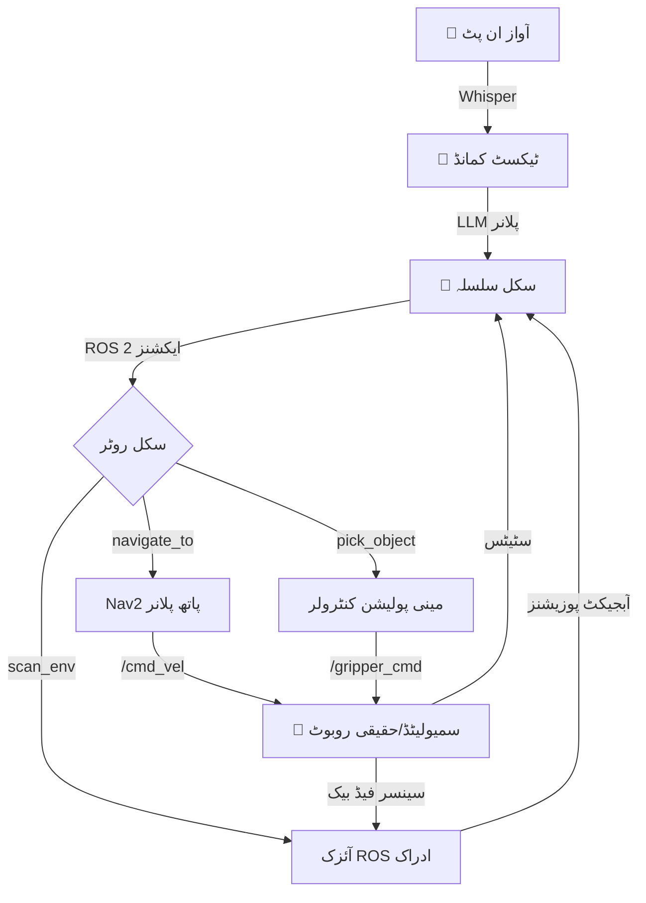

# کیپسٹون: خود مختار ہیومنائیڈ

## جائزہ

**کیپسٹون پروجیکٹ** تمام چار ماڈیولز کو ایک مکمل خود مختار ہیومنائیڈ سسٹم میں مربوط کرتا ہے جو:
1. آواز کے احکامات **سنتا** ہے (ماڈیول 4: Whisper)
2. عمل کے سلسلے کی **منصوبہ بندی** کرتا ہے (ماڈیول 4: LLM)
3. اہداف تک **نیویگیٹ** کرتا ہے (ماڈیول 3: آئزک ROS Nav2)
4. اشیاء کا **ادراک** کرتا ہے (ماڈیول 3: آئزک ROS آبجیکٹ ڈیٹیکشن)
5. اعمال **عملدرآمد** کرتا ہے (ماڈیول 1: ROS 2 کنٹرولرز)
6. سمیولیشن میں **توثیق** کرتا ہے (ماڈیول 2: گزیبو/یونٹی یا ماڈیول 3: آئزک سم)

**مقصد**: یہ ظاہر کریں کہ آپ ایک ہیومنائیڈ روبوٹ ڈیزائن، سمیولیٹ، اور تعینات کر سکتے ہیں جو انسانی ماحول میں مفید کام انجام دیتا ہے۔

## سسٹم آرکیٹیکچر



## مثال: "مجھے سرخ کپ لاؤ"

**صارف کا حکم (آواز)**: "میز سے مجھے سرخ کپ لاؤ"

**پائپ لائن عملدرآمد**:

1. **Whisper ٹرانسکرپشن**:
   - ان پٹ: آڈیو ویو فارم
   - آؤٹ پٹ: متن = "میز سے مجھے سرخ کپ لاؤ"

2. **LLM پلاننگ** (GPT-4 / Claude):
   ```
   پرامپٹ: "آپ ایک ہیومنائیڈ روبوٹ ہیں۔ صارف نے کہا: 'میز سے مجھے سرخ کپ لاؤ'۔
            دستیاب سکلز: navigate_to, scan_environment, detect_object, pick_object, release_object۔
            مرحلہ وار منصوبہ بنائیں۔"

   LLM آؤٹ پٹ:
   [
     {"skill": "navigate_to", "args": {"location": "table"}},
     {"skill": "scan_environment", "args": {}},
     {"skill": "detect_object", "args": {"query": "red cup"}},
     {"skill": "pick_object", "args": {"target": "red_cup_pose"}},
     {"skill": "navigate_to", "args": {"location": "user"}},
     {"skill": "release_object", "args": {}}
   ]
   ```

3. **سکل عملدرآمد** (ROS 2 ایکشنز):
   - `navigate_to("table")` → Nav2 ایکشن سرور `/navigate_to_pose` کال کرتا ہے
   - `scan_environment()` → کیمرا گھماتا ہے، آبجیکٹ میپ بناتا ہے
   - `detect_object("red cup")` → آئزک ROS پر YOLO/OWL-ViT چلاتا ہے
   - `pick_object(pose)` → آرم کنٹرولر کے ساتھ گرفت ٹریجیکٹری عملدرآمد کرتا ہے
   - `navigate_to("user")` → صارف کے مقام پر واپس آتا ہے
   - `release_object()` → گرپر کھولتا ہے

4. **سمیولیشن توثیق** (آئزک سم):
   - ورچوئل کچن میں پوری پائپ لائن کی جانچ کریں
   - تصدیق: نیویگیشن رکاوٹوں سے بچتی ہے، آبجیکٹ ڈیٹیکشن مختلف روشنی میں کام کرتی ہے، گرفت کامیاب ہوتی ہے

5. **ہارڈویئر تعیناتی** (Unitree G1 / OP3):
   - ٹیسٹ شدہ پائپ لائن جسمانی روبوٹ پر لگائیں
   - نگرانی: سینسر شور ہینڈلنگ، رابطہ قوتیں، بیٹری لائف

## سیکھنے کے نتائج

کیپسٹون مکمل کرنے کے بعد، آپ قابل ہو جائیں گے:
1. ✅ ROS 2، سمیولیشن، ادراک، اور VLA کو ایک سسٹم میں مربوط کریں
2. ✅ کثیر ماڈیول ناکامیوں کو ڈیبگ کریں (مثلاً، "آبجیکٹ ڈیٹیکشن کیوں ناکام ہوئی؟")
3. ✅ روبوٹ ٹاسک پلاننگ کے لیے LLM پرامپٹس کو ڈھالیں
4. ✅ سمیولیشن سے حقیقی ہارڈویئر میں رویے منتقل کریں
5. ✅ نئی روبوٹ صلاحیتوں کے لیے سکل لائبریریاں ڈیزائن کریں

## کیپسٹون ورینٹس

### ورینٹ 1: سم ٹو سم (کوئی جسمانی ہارڈویئر نہیں)
- **پلیٹ فارم**: آئزک سم
- **دائرہ کار**: صرف سمیولیشن میں مکمل پائپ لائن
- **ڈیلیوریبل**: روبوٹ "مجھے X لاؤ" کام انجام دیتے ہوئے اسکرین ریکارڈنگ

### ورینٹ 2: سم ٹو ریئل (Jetson + سینسرز کے ساتھ)
- **پلیٹ فارم**: آئزک سم (تربیت) → Jetson Orin (تعیناتی)
- **دائرہ کار**: حقیقی کیمروں پر ادراک لگائیں، حقیقی پہیوں/ٹانگوں پر نیویگیشن
- **ڈیلیوریبل**: آواز کے احکامات کا جواب دیتے جسمانی روبوٹ کی ویڈیو

### ورینٹ 3: ایڈوانسڈ (مکمل ہیومنائیڈ)
- **پلیٹ فارم**: آئزک سم → Unitree G1 / OP3
- **دائرہ کار**: دو پیروں پر چلنا، ماہرانہ ہیرا پھیری، ملٹی موڈل تعامل
- **ڈیلیوریبل**: روبوٹکس کانفرنس یا مقابلے میں مظاہرہ

## جانچ کے معیار

آپ کے کیپسٹون کا جائزہ ان پر لیا جائے گا:

1. **فعالیت** (40%):
   - کیا روبوٹ حکم دیا گیا کام مکمل کرتا ہے؟
   - مختلف حالات (مختلف روشنی، اشیاء کی پوزیشنز) میں کتنا مضبوط ہے؟

2. **انٹیگریشن** (30%):
   - کیا تمام چار ماڈیولز صحیح طریقے سے مربوط ہیں؟
   - ذمہ داریوں کی واضح علیحدگی (ادراک، پلاننگ، کنٹرول)؟

3. **سم ٹو ریئل ٹرانسفر** (20%):
   - اگر جسمانی ہارڈویئر استعمال کر رہے ہیں، کیا سمیولیشن حقیقی دنیا کے رویے کی پیشن گوئی کرتی ہے؟
   - ٹرانسفر کے بعد کتنی ٹیوننگ کی ضرورت پڑی؟

4. **دستاویزات** (10%):
   - سسٹم آرکیٹیکچر کی وضاحت کرنے والا واضح README
   - بیانیے کے ساتھ ویڈیو مظاہرہ
   - استعمال شدہ الگورتھمز کے لیے APA حوالہ جات

## اگلے اقدامات

**تکرار 2 میں**، آپ سیکھیں گے:
- ROS 2 Python میں مکمل VLA پائپ لائن کیسے نافذ کریں
- مضبوط ٹاسک پلاننگ کے لیے LLMs کو کیسے پرامپٹ کریں
- سم ٹو ریئل ٹرانسفر کے لیے آئزک سم پیرامیٹرز کیسے ٹیون کریں
- ROS 2 ٹولز (rqt، rviz، rosbag) کا استعمال کرتے ہوئے کثیر ماڈیول ناکامیوں کو کیسے ڈیبگ کریں

## حوالہ جات

Ahn, M., Brohan, A., Brown, N., et al. (2022). *Do As I Can, Not As I Say: Grounding Language in Robotic Affordances*. Conference on Robot Learning (CoRL).

Driess, D., Xia, F., Sajjadi, M. S., et al. (2023). *PaLM-E: An Embodied Multimodal Language Model*. arXiv preprint arXiv:2303.03378.

Macenski, S., Martín, F., White, R., & Ginés Clavero, J. (2020). *The Marathon 2: A Navigation System*. IEEE/RSJ International Conference on Intelligent Robots and Systems (IROS).
