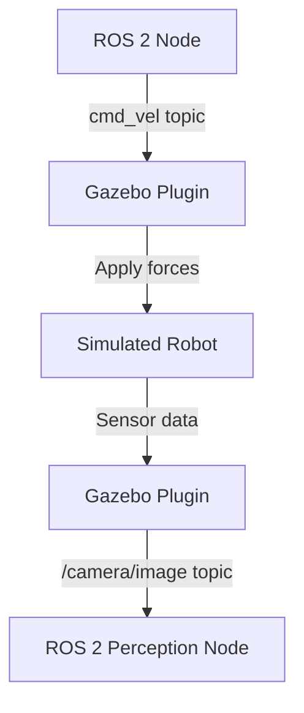

# ماڈیول 2: ڈیجیٹل ٹوئن (گزیبو اور یونٹی)

## جائزہ

**ڈیجیٹل ٹوئن** جسمانی روبوٹ کی ورچوئل نقل ہے جو فزکس، سینسرز، اور ماحول کی سمیولیشن کرتا ہے۔ مہنگے ہارڈویئر پر کوڈ لگانے سے پہلے، آپ سمیولیشن میں رویوں کی جانچ کرتے ہیں جہاں ناکامیاں محفوظ ہیں اور تکرار تیز ہے۔

**ہیومنائیڈ روبوٹس کے لیے سمیولیشن کیوں؟**
- **حفاظت**: خطرناک حرکات (گرنا، ٹکرانا) کو ہارڈویئر کو خطرے میں ڈالے بغیر ٹیسٹ کریں
- **رفتار**: حقیقی دنیا کے تجربات سے 10 گنا تیز تکرار کریں
- **اسکیل ایبلٹی**: جسمانی سیٹ اپ کے بغیر مختلف ماحول (سیڑھیاں، رکاوٹیں، موسم) میں تربیت دیں
- **لاگت**: ترقی کے دوران ہارڈویئر کی ٹوٹ پھوٹ سے بچیں

## سیکھنے کے نتائج

اس ماڈیول کو مکمل کرنے کے بعد، آپ سمجھیں گے:
1. ✅ گزیبو کیسے rigid body فزکس (کشش ثقل، رگڑ، ٹکراؤ) کی سمیولیشن کرتا ہے
2. ✅ ورچوئل سینسرز (کیمرے، لائیڈار، IMU) حقیقی ہارڈویئر کی نقل کیسے کرتے ہیں
3. ✅ فوٹو ریئلسٹک ویژوالائزیشن کے لیے یونٹی کا کردار
4. ✅ ہیومنائیڈ روبوٹکس کے لیے گزیبو بمقابلہ یونٹی کب استعمال کریں

## گزیبو بمقابلہ یونٹی

| خصوصیت | گزیبو | یونٹی |
|---------|--------|-------|
| **فزکس انجن** | ODE، Bullet، DART | PhysX، کسٹم |
| **ROS 2 انٹیگریشن** | مقامی (gazebo_ros) | Unity Robotics Hub |
| **استعمال کا معاملہ** | فنکشنل ٹیسٹنگ، سینسر توثیق | فوٹو ریئلسٹک رینڈرنگ، VR/AR |
| **کارکردگی** | اعتدال پسند (CPU پر مبنی فزکس) | اعلیٰ (GPU سے تیز) |
| **سیکھنے کا منحنی** | مشکل (XML کنفیگ) | آسان (بصری ایڈیٹر) |

**تجویز کردہ حکمت عملی**: تیز ROS 2 پروٹو ٹائپنگ کے لیے **گزیبو**، ویژوالائزیشن اور انسان-روبوٹ تعامل ڈیموز کے لیے **یونٹی** استعمال کریں۔

## اہم تصورات

### 1. فزکس سمیولیشن
**Rigid Body Dynamics**: سمیولیٹ کرتا ہے کہ قوتیں (کشش ثقل، رابطہ، موٹرز) روبوٹ کی حرکت کو کیسے متاثر کرتی ہیں

**ہیومنائیڈ چیلنجز**:
- **توازن**: سپورٹ پولیگون پر مرکز کمیت برقرار رکھنا
- **رابطہ کی قوتیں**: پیر-زمین تعامل، رگڑ کے گتانک
- **ٹکراؤ**: سیلف کولیژن (بازو دھڑ سے ٹکراتا ہے)، ماحولیاتی ٹکراؤ (دیوار، سیڑھیاں)

### 2. سینسر سمیولیشن

#### ورچوئل کیمرا
لینس ڈسٹارشن، شور، موشن بلر کے ساتھ RGB تصاویر کی سمیولیشن

#### ورچوئل لائیڈار
ری کاسٹنگ کے ساتھ لیزر رینج فائنڈرز (2D یا 3D پوائنٹ کلاؤڈز) کی سمیولیشن

#### ورچوئل IMU (انرشیل میجرمنٹ یونٹ)
ایکسلرومیٹر اور گائرو سکوپ کی سمیولیشن (حقیقت پسندانہ شور ماڈلز کے ساتھ)

**سم ٹو ریئل گیپ**: ورچوئل سینسرز بطور ڈیفالٹ "کامل" ہوتے ہیں۔ حقیقی ہارڈویئر سے میچ کرنے کے لیے شور ماڈلز شامل کریں۔

### 3. ورلڈ فائلز (ماحولیاتی تعریفیں)
**گزیبو**: SDF (سمیولیشن ڈسکرپشن فارمیٹ) XML فائلیں متعین کرتی ہیں:
- ٹرین (ہموار زمین، سیڑھیاں، ڈھلوان)
- اشیاء (ڈبے، دروازے، فرنیچر)
- روشنی (سورج، پوائنٹ لائٹس، سائے)

**یونٹی**: GameObjects، Colliders، اور ROS 2 publishers/subscribers کے ساتھ سین فائلز

### 4. گزیبو-ROS انٹیگریشن

**پلگ انز**: گزیبو پلگ انز سمیولیٹڈ سینسرز/ایکچویٹرز کو ROS 2 ٹاپکس سے جوڑتے ہیں

## شرائط

- **سافٹ ویئر**: ROS 2 (ماڈیول 1)، بنیادی 3D گرافکس تصورات
- **ہارڈویئر**: GPU تجویز کردہ (سادہ منظروں کے لیے انٹیگریٹڈ گرافکس ٹھیک ہے)
- **تجربہ**: درمیانی (ROS 2 علم ضروری ہے)

## دوسرے ماڈیولز سے تعلق

**← ماڈیول 1 (ROS 2)**: سمیولیشن ماحول ROS 2 ٹاپکس/سروسز کے ذریعے کنٹرول ہوتے ہیں
**→ ماڈیول 3 (آئزک)**: آئزک سم GPU سے تیز، فوٹو ریئلسٹک سمیولیشن فراہم کرتا ہے
**→ ماڈیول 4 (VLA)**: سمیولیٹڈ روبوٹس ہارڈویئر تعیناتی سے پہلے VLA پائپ لائنز کی جانچ کرتے ہیں

## اگلے اقدامات

**تکرار 2 میں**، آپ سیکھیں گے:
- گزیبو میں ہیومنائیڈ روبوٹ کیسے سپان کریں
- ورچوئل سینسرز (کیمرے، لائیڈار، IMU) کی کنفیگریشن کیسے کریں
- رکاوٹوں اور ٹرین کے ساتھ کسٹم ورلڈز کیسے بنائیں
- فزکس پیرامیٹرز (رگڑ، ڈیمپنگ، رابطہ سختی) کیسے ٹیون کریں

## حوالہ جات

Koenig, N., & Howard, A. (2004). *Design and use paradigms for Gazebo, an open-source multi-robot simulator*. IEEE/RSJ International Conference on Intelligent Robots and Systems (IROS).

Unity Technologies. (2024). *Unity Robotics Hub Documentation*. Retrieved from https://github.com/Unity-Technologies/Unity-Robotics-Hub
