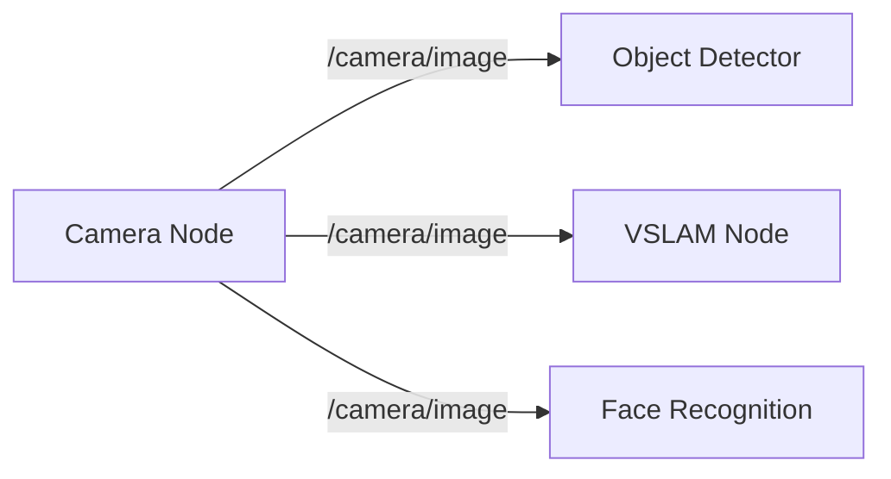

# ماڈیول 1: آر او ایس 2 (روبوٹک اعصابی نظام)

## جائزہ

**آر او ایس 2 (روبوٹ آپریٹنگ سسٹم 2)** کمیونیکیشن فریم ورک ہے جو ہیومنائیڈ روبوٹس کے لیے "اعصابی نظام" کا کام کرتا ہے۔ یہ آزاد سافٹ ویئر اجزاء (نوڈز) کو ریئل ٹائم میں پیغامات کا تبادلہ، اعمال کی ہم آہنگی، اور سینسر ڈیٹا شیئر کرنے کے قابل بناتا ہے۔

**فزیکل اے آئی کے لیے آر او ایس 2 کیوں؟**
- **تقسیم شدہ آرکیٹیکچر**: سینسرز، پلانرز، کنٹرولرز، اور ایکچویٹرز الگ الگ پروسیسز کے طور پر چلتے ہیں
- **مڈل ویئر لچک**: DDS (ڈیٹا ڈسٹری بیوشن سروس) قابل اعتماد، کم تاخیر والی کمیونیکیشن فراہم کرتی ہے
- **ایکو سسٹم**: ادراک، نیویگیشن، ہیرا پھیری، اور کنٹرول کے لیے ہزاروں پیکجز
- **صنعت کا معیار**: بوسٹن ڈائنامکس، اجیلٹی روبوٹکس، این ویڈیا آئزک استعمال کرتے ہیں

## سیکھنے کے نتائج

اس ماڈیول کو مکمل کرنے کے بعد، آپ سمجھیں گے:
1. ✅ آر او ایس 2 نوڈز کیسے ٹاپکس (pub/sub)، سروسز (request/response)، اور ایکشنز (goal-based) کے ذریعے بات چیت کرتے ہیں
2. ✅ ہیومنائیڈ روبوٹ کی ساخت کی تعریف میں URDF (یونیفائیڈ روبوٹ ڈسکرپشن فارمیٹ) کا کردار
3. ✅ اے آئی ایجنٹس (LLMs، ادراک ماڈلز) آر او ایس 2 کنٹرولرز کے ساتھ کیسے مربوط ہوتے ہیں
4. ✅ آر او ایس 1 اور آر او ایس 2 کے درمیان فرق (اور آر او ایس 2 کیوں اہم ہے)

## اہم تصورات

### 1. نوڈز
**تعریف**: آزاد پروسیسز جو مخصوص کام انجام دیتے ہیں (مثلاً، کیمرا ڈرائیور، پاتھ پلانر، موٹر کنٹرولر)

**مثال**: ایک ہیومنائیڈ روبوٹ میں ہو سکتا ہے:
- `camera_node` → سر پر نصب کیمرے سے تصاویر شائع کرتا ہے
- `perception_node` → تصاویر میں اشیاء کا پتہ لگاتا ہے
- `planner_node` → چلنے کی راہ کی منصوبہ بندی کرتا ہے
- `controller_node` → ٹانگوں کو موٹر کمانڈز بھیجتا ہے

### 2. ٹاپکس (Pub/Sub میسجنگ)
**تعریف**: ایک سے زیادہ غیر مطابقت پذیر کمیونیکیشن جہاں نوڈز پیغامات شائع کرتے ہیں اور دوسرے سبسکرائب کرتے ہیں

**استعمال کا معاملہ**: متعدد صارفین کو سینسر ڈیٹا براڈکاسٹ کرنا



### 3. سروسز (Request/Response)
**تعریف**: براہ راست استفسارات کے لیے ایک سے ایک مطابقت پذیر کمیونیکیشن

**استعمال کا معاملہ**: پلانر سے راستہ شمار کرنے کو کہنا

```
کلائنٹ: "A سے B تک راستہ بنائیں"
سرور: "یہ ہے وے پوائنٹ لسٹ: [x1,y1], [x2,y2], ..."
```

### 4. ایکشنز (گول بیسڈ فیڈ بیک کے ساتھ)
**تعریف**: پیشرفت فیڈ بیک اور منسوخی کے ساتھ غیر مطابقت پذیر ہدف پر مبنی کام

**استعمال کا معاملہ**: ہدف مقام پر چلنا

```
ہدف: "باورچی خانے میں جائیں"
فیڈ بیک: "50% مکمل، موجودہ پوزیشن: (2.5, 1.3)"
نتیجہ: "ہدف پہنچ گیا" یا "ہدف ناکام: رکاوٹ ملی"
```

### 5. URDF (روبوٹ ڈسکرپشن)
**تعریف**: روبوٹ کی ساخت (لنکس، جوڑ، سینسرز، ایکچویٹرز) کی وضاحت کرنے والا XML فارمیٹ

**ہیومنائیڈ مثال**:
- **لنکس**: سر، دھڑ، بائیں_بازو، دائیں_بازو، بائیں_ٹانگ، دائیں_ٹانگ
- **جوڑ**: کندھا (ریوولیوٹ)، کہنی (ریوولیوٹ)، کولہا (کروی)، گھٹنا (ریوولیوٹ)
- **سینسرز**: سر میں کیمرے، دھڑ میں IMU، پیروں میں فورس سینسرز

## شرائط

- **سافٹ ویئر**: بنیادی Python پروگرامنگ، لینکس کمانڈ لائن
- **ہارڈویئر**: کوئی نہیں (یہ ماڈیول صرف سمیولیشن استعمال کرتا ہے)
- **تجربہ**: ابتدائی کے لیے موزوں (پہلے سے روبوٹکس کی ضرورت نہیں)

## دوسرے ماڈیولز سے تعلق

**→ ماڈیول 2 (ڈیجیٹل ٹوئن)**: آر او ایس 2 نوڈز گزیبو میں سمیولیٹڈ روبوٹس کو کنٹرول کرتے ہیں
**→ ماڈیول 3 (آئزک)**: آئزک آر او ایس پیکجز جی پی یو سے تیز ادراک کے ساتھ آر او ایس 2 کو بڑھاتے ہیں
**→ ماڈیول 4 (VLA)**: LLMs آر او ایس 2 ایکشن سرورز کو ہدف بھیجتے ہیں

## اگلے اقدامات

**تکرار 2 میں**، آپ سیکھیں گے:
- Python (`rclpy`) میں آر او ایس 2 نوڈز کیسے لکھیں
- کسٹم میسج ٹائپس کی تعریف کیسے کریں
- `rqt` اور `rviz2` کے ساتھ ٹاپکس کو ویژوالائز کیسے کریں
- ہیومنائیڈ روبوٹس کے لیے URDF فائلیں کیسے لکھیں

## حوالہ جات

Macenski, S., Foote, T., Gerkey, B., Lalancette, C., & Woodall, W. (2022). *Robot Operating System 2: Design, architecture, and uses in the wild*. Science Robotics, 7(66).

Open Robotics. (2023). *ROS 2 Humble Documentation*. Retrieved from https://docs.ros.org/en/humble/
