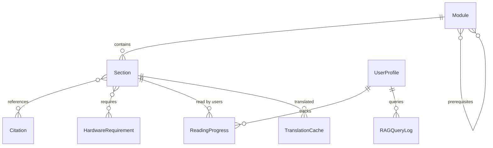

# Data Model: Physical AI & Humanoid Robotics Book

**Date**: 2025-12-05
**Feature**: 002-book-layout-structure
**Purpose**: Define content structure and user data schemas

---

## Content Entities

### Entity: Module

**Purpose**: Top-level learning unit covering one aspect of Physical AI for humanoid robots

**Attributes**:
- `id` (string, unique): Identifier (e.g., "module-1-ros2")
- `title` (string): Display name (e.g., "Module 1: Robotic Nervous System (ROS 2)")
- `order` (integer): Sequence number (1-4)
- `description` (string): Brief overview (1-2 sentences)
- `prerequisites` (array<string>): Module IDs required before this (e.g., Module 3 requires Module 1)
- `learning_outcomes` (array<string>): What readers will learn
- `sections` (array<Section>): Child sections
- `estimated_time_hours` (integer): Estimated completion time

**Relationships**:
- Contains multiple **Sections** (1:many)
- May depend on other **Modules** via prerequisites (many:many)

**Validation Rules**:
- `order` must be unique within project (1-4)
- `prerequisites` must reference existing module IDs
- `id` must match pattern: `module-{number}-{slug}`

**Example**:
```json
{
  "id": "module-1-ros2",
  "title": "Module 1: Robotic Nervous System (ROS 2)",
  "order": 1,
  "description": "Learn how robots communicate using ROS 2 Topics, Services, and Actions",
  "prerequisites": [],
  "learning_outcomes": [
    "Understand ROS 2 communication patterns",
    "Design robot software architectures",
    "Integrate AI agents with ROS 2 controllers"
  ],
  "sections": [...],
  "estimated_time_hours": 8
}
```

---

### Entity: Section

**Purpose**: Sub-unit within a module (e.g., "Conceptual Overview", "Key Concepts")

**Attributes**:
- `id` (string, unique): Identifier (e.g., "module-1-ros2/key-concepts")
- `title` (string): Display name
- `content` (markdown): Main content body
- `difficulty` (enum): beginner | intermediate | advanced
- `requires_hardware` (boolean): Whether this section needs physical hardware
- `hardware_types` (array<string>): Specific hardware if required (e.g., ["rtx-gpu", "jetson-orin-nx"])
- `keywords` (array<string>): For search and RAG retrieval
- `estimated_time_minutes` (integer): Estimated reading/completion time
- `order` (integer): Position within module

**Relationships**:
- Belongs to one **Module** (many:1)
- May reference other **Sections** via cross-links (many:many)
- References zero or more **Citations** (many:many)

**Validation Rules**:
- `id` must match pattern: `{module-id}/{section-slug}`
- `difficulty` must be one of: beginner, intermediate, advanced
- `hardware_types` must reference valid **HardwareRequirement** IDs
- `keywords` should be lowercase, hyphen-separated

**Example**:
```json
{
  "id": "module-1-ros2/key-concepts",
  "title": "Key Concepts",
  "content": "# Key Concepts\n\nROS 2 uses three main communication patterns...",
  "difficulty": "beginner",
  "requires_hardware": false,
  "hardware_types": [],
  "keywords": ["ros-2", "topics", "services", "actions", "communication"],
  "estimated_time_minutes": 15,
  "order": 4
}
```

---

### Entity: HardwareRequirement

**Purpose**: Hardware specification referenced in content

**Attributes**:
- `id` (string, unique): Identifier (e.g., "rtx-gpu", "jetson-orin-nano")
- `category` (enum): simulation_rig | edge_ai_kit | sensors | robot_platform
- `name` (string): Display name (e.g., "NVIDIA RTX GPU")
- `description` (string): Brief description
- `cost_range` (string): Price range (e.g., "$200-500", "$1000+")
- `required_for` (array<string>): Module IDs requiring this hardware
- `alternatives` (array<string>): Alternative hardware IDs or cloud options
- `specs` (object): Key specifications (varies by category)

**Relationships**:
- Referenced by **Sections** that require hardware (many:many)
- Can reference alternative **HardwareRequirements** (many:many)

**Validation Rules**:
- `category` must be one of: simulation_rig, edge_ai_kit, sensors, robot_platform
- `required_for` must reference valid module IDs
- `alternatives` must reference valid hardware IDs or be null

**Examples**:

```json
{
  "id": "rtx-gpu",
  "category": "simulation_rig",
  "name": "NVIDIA RTX GPU",
  "description": "GPU with ray-tracing for Isaac Sim",
  "cost_range": "$500-2000",
  "required_for": ["module-3-isaac"],
  "alternatives": ["cloud-gpu"],
  "specs": {
    "min_model": "RTX 3070",
    "min_vram_gb": 8,
    "recommended_model": "RTX 4090",
    "recommended_vram_gb": 24
  }
},
{
  "id": "jetson-orin-nx",
  "category": "edge_ai_kit",
  "name": "NVIDIA Jetson Orin NX 16GB",
  "description": "Edge AI computer with 100 TOPS",
  "cost_range": "$899",
  "required_for": ["module-3-isaac", "module-4-vla"],
  "alternatives": ["jetson-orin-nano"],
  "specs": {
    "tops": 100,
    "ram_gb": 16,
    "storage": "NVMe SSD"
  }
}
```

---

### Entity: Citation

**Purpose**: APA-formatted source reference

**Attributes**:
- `id` (string, unique): Short reference key (e.g., "macenski2022")
- `authors` (string): APA author list
- `year` (integer): Publication year
- `title` (string): Article/book title
- `publication` (string): Journal, conference, or publisher
- `url` (string): Direct link to source
- `doi` (string, optional): Digital Object Identifier
- `access_date` (string, optional): For web sources (ISO 8601 date)
- `citation_type` (enum): journal | conference | book | website | documentation

**Relationships**:
- Referenced by **Sections** that cite this source (many:many)

**Validation Rules**:
- `id` must match pattern: `{first_author_last_name}{year}`
- `year` must be 4-digit integer
- `url` must be valid URL if provided
- `citation_type` must be one of allowed types

**Example**:
```json
{
  "id": "macenski2022",
  "authors": "Macenski, S., Foote, T., Gerkey, B., Lalancette, C., & Woodall, W.",
  "year": 2022,
  "title": "Robot Operating System 2: Design, architecture, and uses in the wild",
  "publication": "Science Robotics, 7(66)",
  "url": "https://doi.org/10.1126/scirobotics.abm6074",
  "doi": "10.1126/scirobotics.abm6074",
  "access_date": "2025-12-05",
  "citation_type": "journal"
}
```

---

## User Data Entities

### Entity: UserProfile

**Purpose**: Store user preferences, hardware inventory, and experience levels

**Storage**: Neon Serverless Postgres

**Schema** (PostgreSQL):
```sql
CREATE TABLE user_profiles (
  id UUID PRIMARY KEY DEFAULT gen_random_uuid(),
  email VARCHAR(255) UNIQUE NOT NULL,
  created_at TIMESTAMP DEFAULT CURRENT_TIMESTAMP,
  updated_at TIMESTAMP DEFAULT CURRENT_TIMESTAMP,

  -- Hardware Inventory
  has_rtx_gpu BOOLEAN DEFAULT FALSE,
  has_jetson BOOLEAN DEFAULT FALSE,
  jetson_model VARCHAR(50), -- 'orin-nano-4gb', 'orin-nano-8gb', 'orin-nx-8gb', 'orin-nx-16gb', null
  robot_type VARCHAR(50) DEFAULT 'none', -- 'none', 'proxy', 'go2', 'op3', 'g1'
  has_realsense BOOLEAN DEFAULT FALSE,
  has_lidar BOOLEAN DEFAULT FALSE,

  -- Experience Levels
  ros2_experience VARCHAR(20) DEFAULT 'none', -- 'none', 'beginner', 'intermediate', 'advanced'
  ml_experience VARCHAR(20) DEFAULT 'none',
  robotics_experience VARCHAR(20) DEFAULT 'none',
  simulation_experience VARCHAR(20) DEFAULT 'none',

  -- Preferences
  preferred_language VARCHAR(10) DEFAULT 'en', -- 'en', 'ur'
  theme VARCHAR(20) DEFAULT 'light', -- 'light', 'dark'

  -- Constraints
  CONSTRAINT valid_jetson_model CHECK (jetson_model IN ('orin-nano-4gb', 'orin-nano-8gb', 'orin-nx-8gb', 'orin-nx-16gb', null)),
  CONSTRAINT valid_robot_type CHECK (robot_type IN ('none', 'proxy', 'go2', 'op3', 'g1')),
  CONSTRAINT valid_experience CHECK (
    ros2_experience IN ('none', 'beginner', 'intermediate', 'advanced') AND
    ml_experience IN ('none', 'beginner', 'intermediate', 'advanced') AND
    robotics_experience IN ('none', 'beginner', 'intermediate', 'advanced') AND
    simulation_experience IN ('none', 'beginner', 'intermediate', 'advanced')
  ),
  CONSTRAINT valid_language CHECK (preferred_language IN ('en', 'ur'))
);

CREATE INDEX idx_user_email ON user_profiles(email);
CREATE INDEX idx_user_hardware ON user_profiles(has_rtx_gpu, has_jetson, robot_type);
```

**State Transitions**:
1. **Signup** → Profile created with defaults (all hardware = false, experience = 'none')
2. **Onboarding Survey** → Hardware and experience fields populated
3. **Profile Updates** → User can update anytime, triggers personalization re-evaluation
4. **Account Deletion** → Soft delete or hard delete (GDPR compliance)

**Business Rules**:
- Email must be verified before full access
- Hardware fields determine content personalization
- Experience levels affect difficulty recommendations

---

### Entity: ReadingProgress

**Purpose**: Track which modules/sections user has viewed and completed

**Storage**: Neon Serverless Postgres

**Schema** (PostgreSQL):
```sql
CREATE TABLE reading_progress (
  id UUID PRIMARY KEY DEFAULT gen_random_uuid(),
  user_id UUID NOT NULL REFERENCES user_profiles(id) ON DELETE CASCADE,
  section_id VARCHAR(255) NOT NULL, -- e.g., "module-1-ros2/key-concepts"
  started_at TIMESTAMP DEFAULT CURRENT_TIMESTAMP,
  completed_at TIMESTAMP,
  time_spent_seconds INTEGER DEFAULT 0,
  scroll_percentage FLOAT DEFAULT 0.0, -- 0.0 to 1.0

  UNIQUE(user_id, section_id)
);

CREATE INDEX idx_progress_user ON reading_progress(user_id);
CREATE INDEX idx_progress_section ON reading_progress(section_id);
CREATE INDEX idx_progress_completed ON reading_progress(user_id, completed_at) WHERE completed_at IS NOT NULL;
```

**Business Rules**:
- Section marked "started" on first view
- Section marked "completed" when scroll_percentage >= 0.9
- time_spent_seconds tracks active reading time (not idle time)
- Used for progress tracking and recommendations

---

### Entity: RAGQueryLog

**Purpose**: Track chatbot interactions for quality improvement and analytics

**Storage**: Neon Serverless Postgres

**Schema** (PostgreSQL):
```sql
CREATE TABLE rag_query_log (
  id UUID PRIMARY KEY DEFAULT gen_random_uuid(),
  user_id UUID REFERENCES user_profiles(id) ON DELETE SET NULL, -- NULL if anonymous
  query_text TEXT NOT NULL,
  query_mode VARCHAR(50) NOT NULL, -- 'book-wide' or 'selection-based'
  selected_text TEXT, -- Only for selection-based queries
  retrieved_chunks JSONB, -- Array of {section_id, score, excerpt}
  response_text TEXT NOT NULL,
  user_feedback VARCHAR(20), -- 'helpful', 'not-helpful', null
  feedback_comment TEXT,
  created_at TIMESTAMP DEFAULT CURRENT_TIMESTAMP,
  response_time_ms INTEGER,

  CONSTRAINT valid_query_mode CHECK (query_mode IN ('book-wide', 'selection-based')),
  CONSTRAINT valid_feedback CHECK (user_feedback IS NULL OR user_feedback IN ('helpful', 'not-helpful'))
);

CREATE INDEX idx_rag_user ON rag_query_log(user_id);
CREATE INDEX idx_rag_created ON rag_query_log(created_at);
CREATE INDEX idx_rag_feedback ON rag_query_log(user_feedback) WHERE user_feedback IS NOT NULL;
```

**Business Rules**:
- Anonymous queries allowed (user_id = NULL)
- Feedback optional but encouraged
- retrieved_chunks stores RAG retrieval metadata for debugging
- Used for quality metrics and model improvement

---

### Entity: TranslationCache

**Purpose**: Cache translated content to reduce API costs and improve performance

**Storage**: Neon Serverless Postgres

**Schema** (PostgreSQL):
```sql
CREATE TABLE translation_cache (
  id UUID PRIMARY KEY DEFAULT gen_random_uuid(),
  section_id VARCHAR(255) NOT NULL,
  target_language VARCHAR(10) NOT NULL,
  content_hash VARCHAR(64) NOT NULL, -- SHA-256 of original content
  original_content TEXT NOT NULL,
  translated_content TEXT NOT NULL,
  created_at TIMESTAMP DEFAULT CURRENT_TIMESTAMP,
  access_count INTEGER DEFAULT 0,
  last_accessed_at TIMESTAMP DEFAULT CURRENT_TIMESTAMP,

  UNIQUE(section_id, target_language, content_hash)
);

CREATE INDEX idx_translation_lookup ON translation_cache(section_id, target_language, content_hash);
CREATE INDEX idx_translation_language ON translation_cache(target_language);
```

**Business Rules**:
- Cache key = (section_id, target_language, content_hash)
- content_hash changes when original content updated → cache miss
- access_count tracks cache hit frequency (for cleanup decisions)
- Cache eviction: LRU (Least Recently Used) when storage limit reached

---

## Entity Relationships Diagram



---

## Data Access Patterns

### Content Queries (Docusaurus Build Time)

1. **Get all modules with sections**:
   - Read all `docs/module-*/` directories
   - Parse frontmatter for metadata
   - Build Docusaurus sidebar structure

2. **Get hardware requirements for module**:
   - Read section frontmatter
   - Extract `requires_hardware` and `hardware_types`
   - Display hardware checklist in module intro

3. **Get citations for section**:
   - Parse inline citations `(Author, Year)`
   - Match against `citations.json`
   - Generate References section at page bottom

### User Queries (Runtime, FastAPI Backend)

1. **Get user profile**:
   ```sql
   SELECT * FROM user_profiles WHERE email = $1;
   ```

2. **Get reading progress for user**:
   ```sql
   SELECT section_id, completed_at, time_spent_seconds
   FROM reading_progress
   WHERE user_id = $1
   ORDER BY started_at DESC;
   ```

3. **Check translation cache**:
   ```sql
   SELECT translated_content
   FROM translation_cache
   WHERE section_id = $1 AND target_language = $2 AND content_hash = $3;
   ```

4. **Log RAG query**:
   ```sql
   INSERT INTO rag_query_log (user_id, query_text, query_mode, retrieved_chunks, response_text, response_time_ms)
   VALUES ($1, $2, $3, $4, $5, $6);
   ```

---

## Data Validation Rules

### Content Validation (Build Time)

- All section IDs must be unique
- All module `prerequisites` must reference existing modules
- All `hardware_types` must reference defined hardware
- All inline citations must have corresponding entry in `citations.json`
- Markdown frontmatter must be valid YAML

### User Data Validation (Runtime)

- Email must be valid format and unique
- Experience levels must be from allowed enum values
- Jetson model must match allowed options
- Robot type must match allowed options
- Query text must not exceed 2000 characters (prevent abuse)

---

## Migration Strategy

**Phase 1**: Content entities (static, build-time)
- Store as Markdown frontmatter
- No database needed
- Validated at build time

**Phase 2**: User entities (dynamic, runtime)
- Create Neon Postgres database
- Run SQL migrations (using Alembic)
- FastAPI connects via DATABASE_URL

**Phase 3**: Integration
- Docusaurus calls FastAPI for personalization
- RAG chatbot queries Qdrant + Neon
- Translation cache reduces OpenAI costs

---

## Summary

**Content Entities**: Module, Section, HardwareRequirement, Citation (static, Markdown)
**User Entities**: UserProfile, ReadingProgress, RAGQueryLog, TranslationCache (dynamic, Postgres)

**Storage**:
- Content: Markdown files (docs/)
- Vectors: Qdrant Cloud (embeddings)
- User Data: Neon Postgres (profiles, logs)

**Ready for**: API contract design (contracts/) and quickstart guide creation
